# **Assignment2**

### Tags used

 - Owner siddhant.sharma@tigeranalytics.com

 - Project aws-training

 - Team mle

 - Name siddhant-ec2

### Output Window of Flask App 

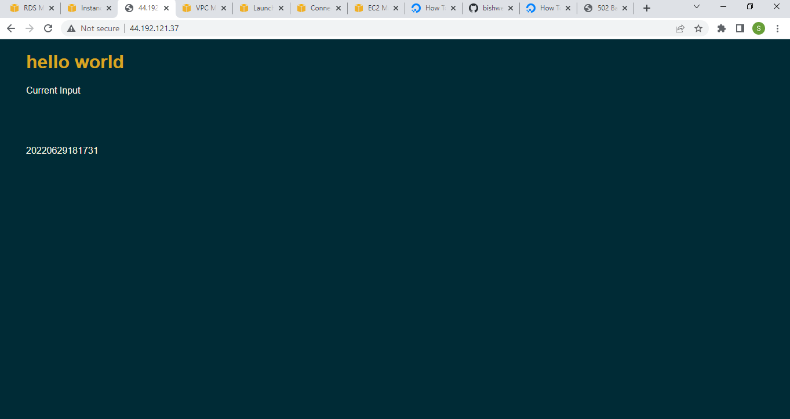
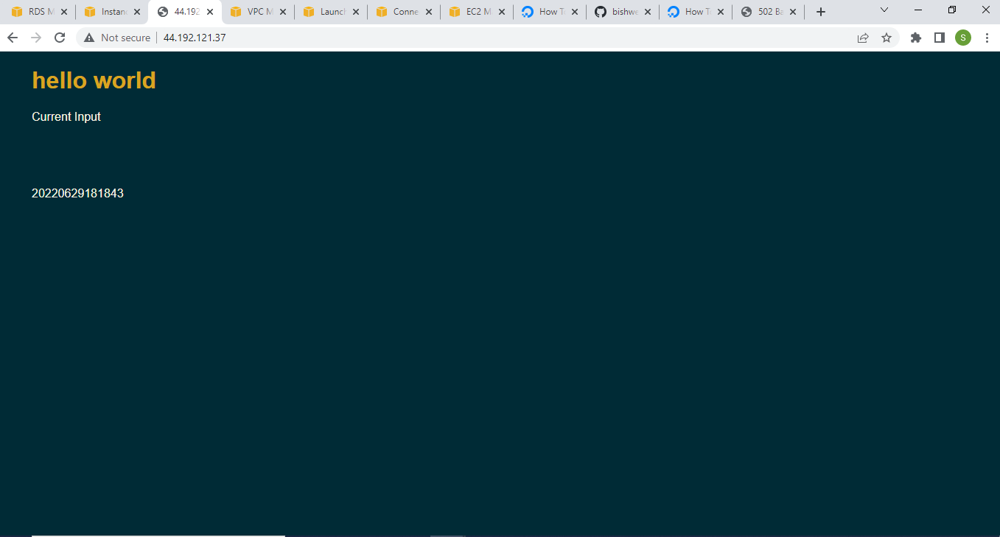

### VPC and Subnets

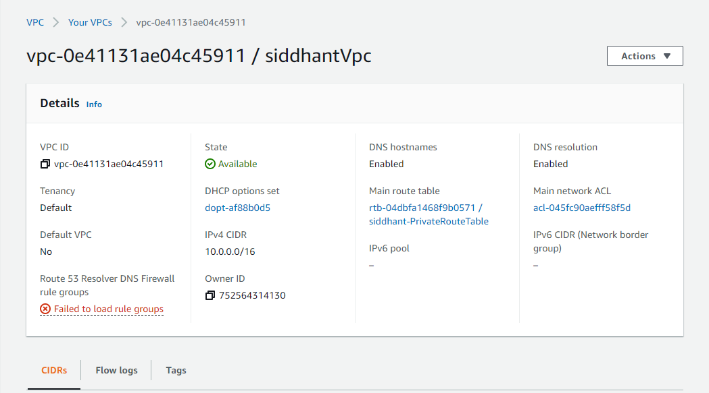
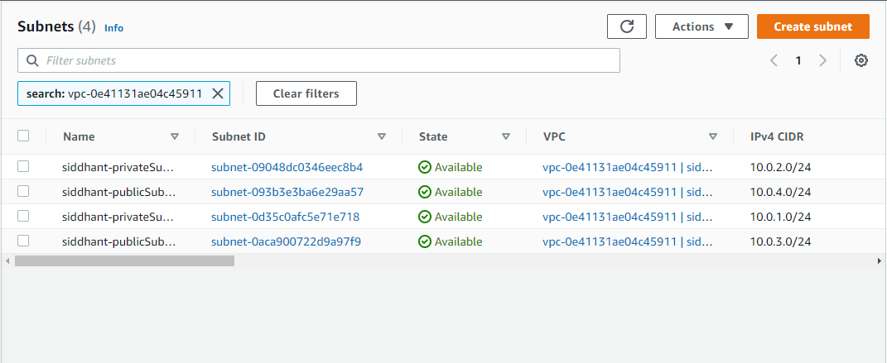

### Route tables for subnets

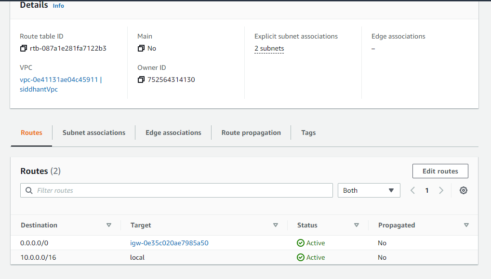

### RDS
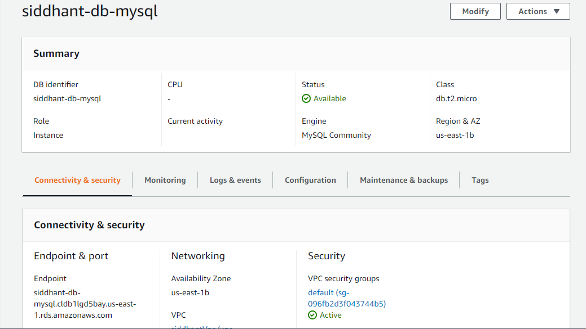

### EC2 
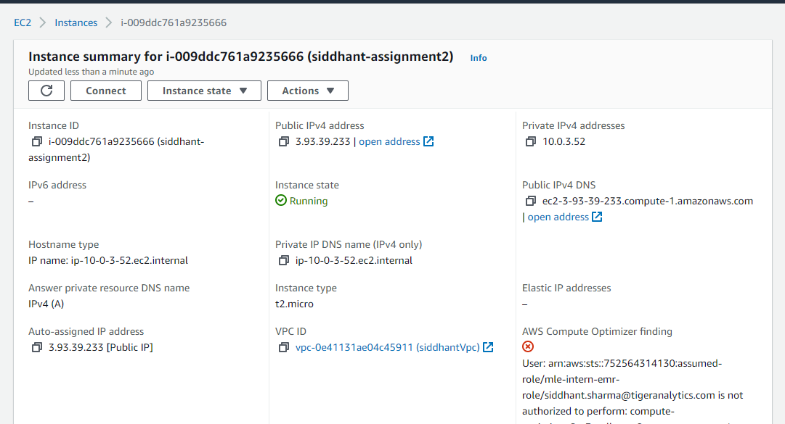
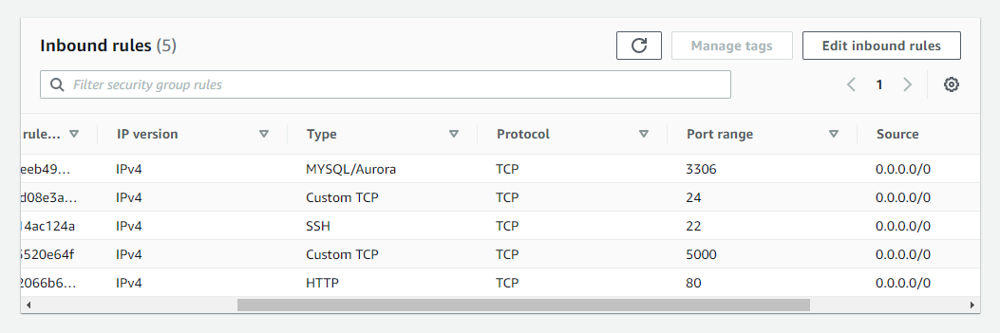

### AutoScaling Group
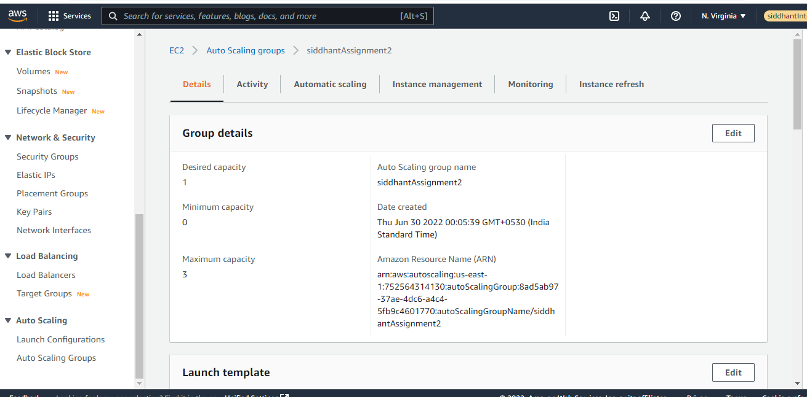
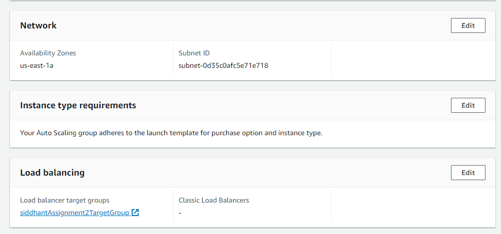

### Load Balancer and Target Group
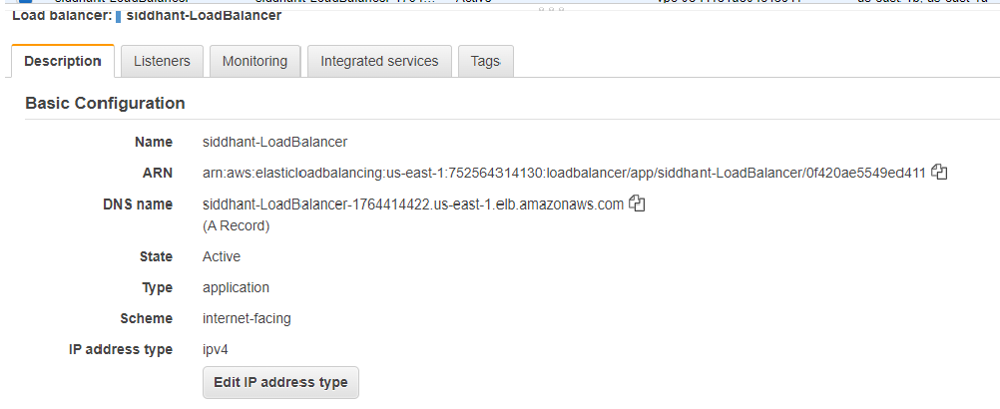
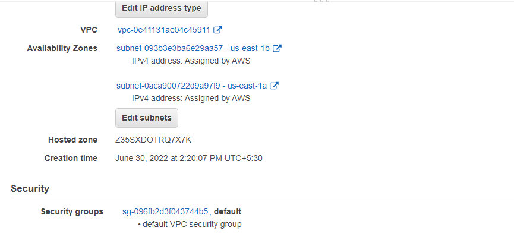
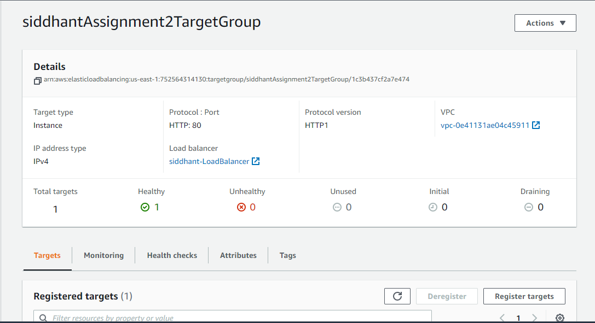

### Lambda Function
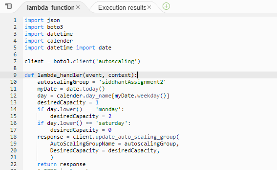
