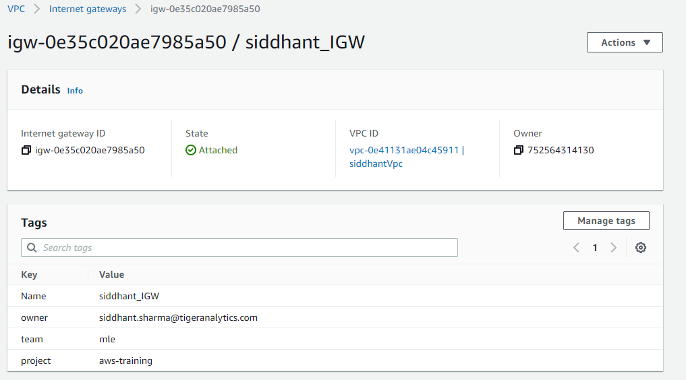
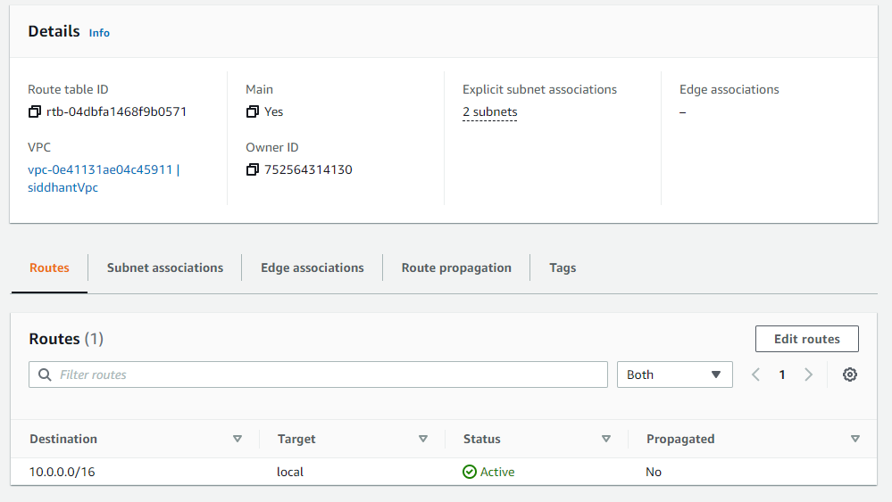
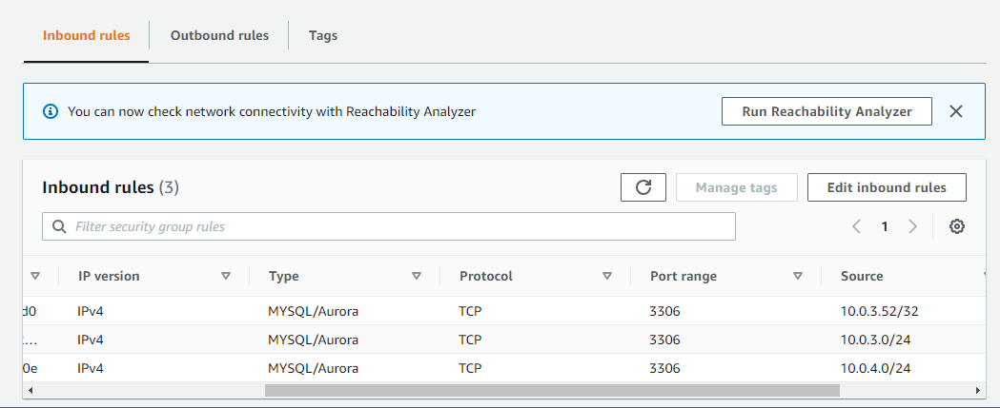

# **Assignment2**

### Tags used

 - Owner siddhant.sharma@tigeranalytics.com

 - Project aws-training

 - Team mle

 - Name siddhant-ec2

### Output Window of Flask App 

### VPC and Subnets

### Route tables for subnets

### RDS

### EC2 

### AutoScaling Group

### Load Balancer and Target Group

### Lambda Function

